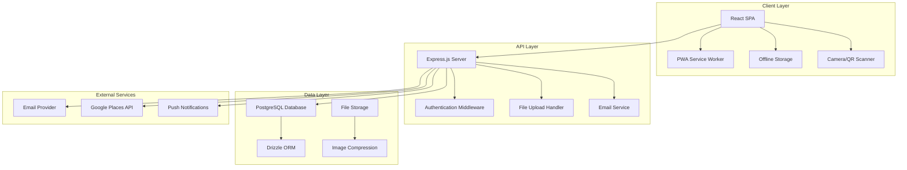
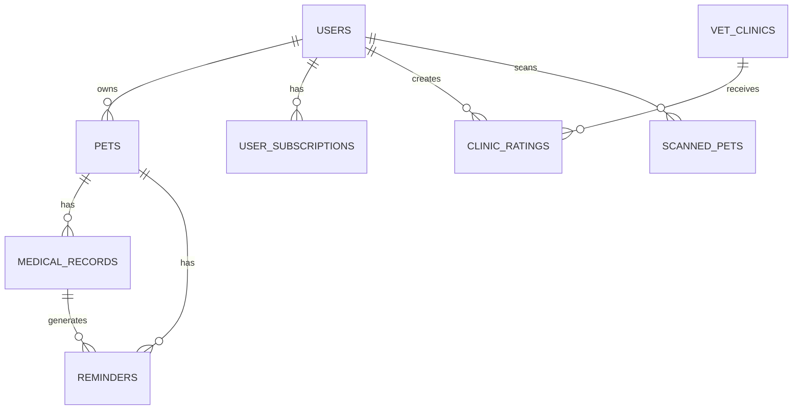

# Design Document

## Overview

The ASOPETS digital pet health records system is designed as a full-stack web application with mobile-first responsive design and Progressive Web App (PWA) capabilities. The architecture follows a client-server model with React frontend, Express.js backend, and PostgreSQL database. The system emphasizes offline functionality, real-time synchronization, and secure data sharing through QR codes.

## Architecture

### System Architecture



### Technology Stack

**Frontend:**
- React 18 with TypeScript
- Wouter for routing
- TanStack Query for state management and caching
- Tailwind CSS with Radix UI components
- Capacitor for mobile app packaging
- Service Worker for offline functionality

**Backend:**
- Node.js with Express.js
- TypeScript for type safety
- Drizzle ORM with PostgreSQL
- Express-session for authentication
- Multer for file uploads
- Nodemailer for email services

**Database:**
- PostgreSQL with the following core tables:
  - users, pets, medical_records, reminders
  - vet_clinics, clinic_ratings, scanned_pets
  - subscription_plans, user_subscriptions

## Components and Interfaces

### Core Components

#### 1. Pet Management Components
- **PetCard**: Displays pet summary with photo, name, and quick stats
- **PetEditForm**: Form for creating and editing pet profiles
- **PetProfile**: Comprehensive pet view with tabbed interface

#### 2. Medical Record Components
- **MedicalRecordForm**: Dynamic form supporting all medical record types
- **MedicalTimeline**: Chronological display of all medical events
- **HealthSummaryCard**: Dashboard widget showing health status

#### 3. QR Code Components
- **QRCodeGenerator**: Generates and displays shareable QR codes
- **QRScanner**: Camera-based QR code scanning functionality
- **SharedPetProfile**: Public view for scanned pet profiles

#### 4. Reminder System Components
- **MedicationReminderManager**: Manages upcoming treatments and notifications
- **NotificationDropdown**: Displays pending reminders and alerts

#### 5. Clinic Management Components
- **VetClinics**: Searchable list of veterinary clinics
- **ClinicReviews**: Rating and review system for clinics
- **GoogleMap**: Interactive map showing clinic locations

### API Interface Design

#### Authentication Endpoints
```typescript
POST /api/auth/signup
POST /api/auth/login
POST /api/auth/logout
POST /api/auth/forgot-password
POST /api/auth/reset-password
GET /api/auth/confirm-email/:token
```

#### Pet Management Endpoints
```typescript
GET /api/pets - Get user's pets
POST /api/pets - Create new pet
PUT /api/pets/:id - Update pet
DELETE /api/pets/:id - Delete pet
GET /api/pets/:id - Get specific pet
POST /api/pets/:id/photo - Upload pet photo
```

#### Medical Records Endpoints
```typescript
GET /api/pets/:petId/medical-records - Get pet's medical history
POST /api/pets/:petId/medical-records - Create medical record
PUT /api/medical-records/:id - Update medical record
DELETE /api/medical-records/:id - Delete medical record
POST /api/medical-records/:id/attachments - Upload medical attachments
```

#### QR Sharing Endpoints
```typescript
GET /api/pets/:id/qr-code - Generate QR code for pet
GET /api/share/pet/:shareToken - Get shared pet profile
POST /api/scanned-pets - Save scanned pet to user's list
```

## Data Models

### Core Entities

#### User Entity
```typescript
interface User {
  id: string;
  email: string;
  firstName: string;
  lastName: string;
  phone?: string;
  emergencyContact?: string;
  emergencyPhone?: string;
  notificationPreferences: {
    email: boolean;
    sms: boolean;
    push: boolean;
    reminders: boolean;
  };
  subscription: UserSubscription;
}
```

#### Pet Entity
```typescript
interface Pet {
  id: number;
  userId: string;
  name: string;
  category: 'dog' | 'cat' | 'bird' | 'rabbit' | 'horse' | 'exotic' | 'other';
  breed?: string;
  dateOfBirth?: Date;
  age?: number; // in months
  microchipId?: string;
  birthmarks?: string;
  imageUrl?: string;
  shareToken: string; // for QR code sharing
}
```

#### Medical Record Entity
```typescript
interface MedicalRecord {
  id: number;
  petId: number;
  type: 'vaccine' | 'deworming' | 'treatment' | 'surgery' | 'checkup' | 'lab-test' | 'grooming';
  title: string;
  description?: string;
  dateAdministered: Date;
  nextDueDate?: Date;
  veterinarian?: string;
  clinic?: string;
  weight?: string;
  cost?: string;
  attachments: string[];
  reminderEnabled: boolean;
}
```

### Database Schema Relationships



## Error Handling

### Client-Side Error Handling
- **Network Errors**: Automatic retry with exponential backoff
- **Validation Errors**: Real-time form validation with user-friendly messages
- **Authentication Errors**: Automatic redirect to login with session restoration
- **File Upload Errors**: Progress indication and error recovery options

### Server-Side Error Handling
- **Input Validation**: Zod schema validation for all API endpoints
- **Database Errors**: Transaction rollback and graceful error responses
- **File Processing Errors**: Image compression fallbacks and size limits
- **Rate Limiting**: API throttling to prevent abuse

### Offline Error Handling
- **Data Synchronization**: Queue failed requests for retry when online
- **Conflict Resolution**: Last-write-wins strategy with user notification
- **Storage Limits**: Graceful degradation when local storage is full

## Testing Strategy

### Unit Testing
- **Component Testing**: React Testing Library for UI components
- **API Testing**: Jest for endpoint logic and validation
- **Database Testing**: In-memory database for ORM operations
- **Utility Testing**: Pure function testing for business logic

### Integration Testing
- **API Integration**: End-to-end API workflow testing
- **Database Integration**: Real database operations with test data
- **File Upload Integration**: Mock file processing and storage
- **Authentication Flow**: Complete login/signup/logout cycles

### Mobile Testing
- **Responsive Design**: Cross-device viewport testing
- **PWA Functionality**: Service worker and offline capability testing
- **Camera Integration**: QR scanner functionality across devices
- **Performance Testing**: Mobile-specific performance metrics

### Security Testing
- **Authentication Security**: Session management and token validation
- **Data Privacy**: Ensure PII protection in shared profiles
- **File Upload Security**: Malicious file detection and sanitization
- **API Security**: Rate limiting and input sanitization

## Performance Considerations

### Frontend Optimization
- **Code Splitting**: Lazy loading of route components
- **Image Optimization**: Automatic compression and WebP conversion
- **Caching Strategy**: Aggressive caching of static assets and API responses
- **Bundle Size**: Tree shaking and dependency optimization

### Backend Optimization
- **Database Indexing**: Optimized queries for pet and medical record lookups
- **File Storage**: CDN integration for image delivery
- **API Response Caching**: Redis caching for frequently accessed data
- **Connection Pooling**: Efficient database connection management

### Mobile Performance
- **Offline First**: Critical functionality available without network
- **Progressive Loading**: Skeleton screens and lazy loading
- **Touch Optimization**: Responsive touch targets and gestures
- **Battery Efficiency**: Minimal background processing

## Security Architecture

### Authentication & Authorization
- **Session-Based Auth**: Secure HTTP-only cookies with CSRF protection
- **Password Security**: bcrypt hashing with salt rounds
- **Email Verification**: Required for account activation
- **Password Reset**: Secure token-based password recovery

### Data Protection
- **Encryption**: TLS 1.3 for all data transmission
- **Data Minimization**: Only collect necessary information
- **Access Control**: User-specific data isolation
- **Audit Logging**: Track access to shared pet profiles

### QR Code Security
- **Token-Based Sharing**: Unique, non-guessable share tokens
- **Limited Information**: Shared profiles exclude sensitive owner data
- **Access Logging**: Track when and how QR codes are accessed
- **Revocation**: Ability to regenerate share tokens

## Scalability Design

### Horizontal Scaling
- **Stateless API**: Session data stored in database, not memory
- **Load Balancing**: Multiple server instances behind load balancer
- **Database Scaling**: Read replicas for query optimization
- **File Storage**: Cloud storage with CDN distribution

### Vertical Scaling
- **Database Optimization**: Query optimization and indexing
- **Memory Management**: Efficient caching strategies
- **CPU Optimization**: Async processing for heavy operations
- **Storage Efficiency**: Image compression and cleanup routines